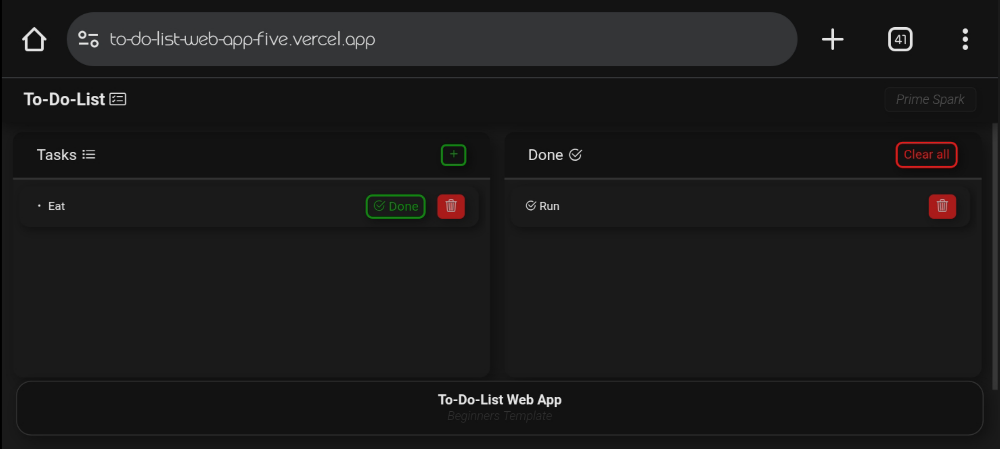

# To-Do List Web App

A simple and lightweight web-based to-do list application built using HTML, CSS, and JavaScript.

## 📁 Project Structure

- `index.html` – The main HTML file that structures the to-do app.
- `index.css` – Styling for the to-do app interface.
- `index.js` – JavaScript functionality for adding, removing, and managing tasks.

## 🚀 Features

- Add and delete tasks
- Simple and clean UI
- Responsive design

## 📷 Screenshot

## 🛠️ Getting Started

To run this project locally:

1. Download or clone the repository.
2. Open `index.html` in your web browser.
3. Start adding tasks!

## 📌 Note

This is a basic project for educational purposes. Feel free to build on it or integrate with a backend for data persistence.

## ⚠️ Disclaimer

This project is provided "as-is" without any warranty. It is intended for learning and demonstration purposes only. Use or modify it at your own discretion.

## 📄 License

This project is licensed under the [MIT License](./LICENSE) — © 2025 Prime Spark || Full Stack Dev. See the `LICENSE` file for details.
